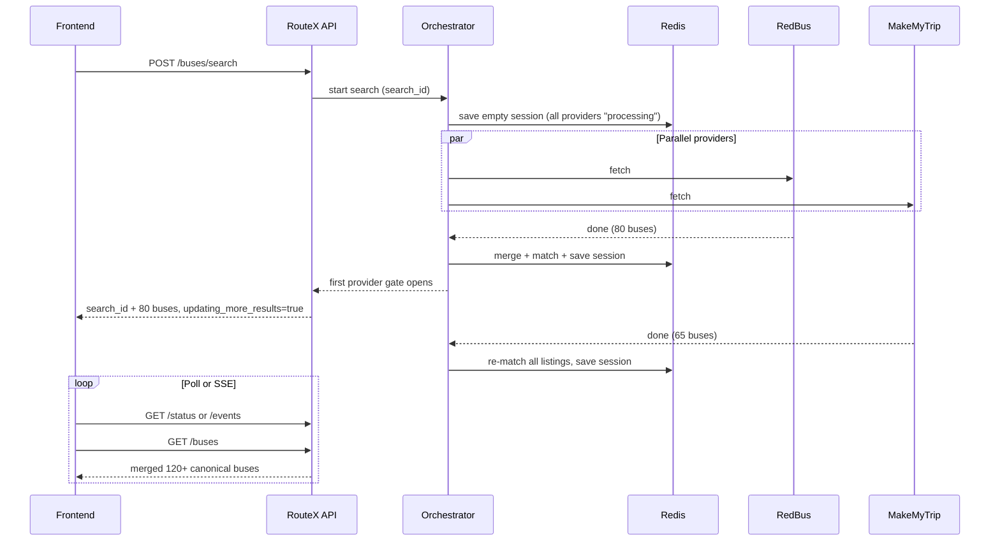

# RouteX API — Backend & System Documentation

This document is the primary reference for **frontend developers** integrating with RouteX, and for anyone who needs to understand **how the backend architecture works** end to end.

**Base URL (local dev):** `http://localhost:3000`

---

## Table of contents

1. [Quick start for frontend](#1-quick-start-for-frontend)
2. [API reference](#2-api-reference)
3. [Data models](#3-data-models)
4. [Progressive search flow](#4-progressive-search-flow)
5. [System architecture](#5-system-architecture)
6. [Cache architecture (3 layers)](#6-cache-architecture-3-layers)
7. [Provider execution pipeline](#7-provider-execution-pipeline)
8. [Cross-provider matching & deal scoring](#8-cross-provider-matching--deal-scoring)
9. [Resilience: retries, circuit breaker, health](#9-resilience-retries-circuit-breaker-health)
10. [Self-healing](#10-self-healing)
11. [Redis key reference](#11-redis-key-reference)
12. [Error handling](#12-error-handling)
13. [Environment variables](#13-environment-variables)
14. [Frontend integration patterns](#14-frontend-integration-patterns)

---

## 1. Quick start for frontend

Typical user journey:

```text
1. POST /api/v1/buses/search          → get search_id + first page of buses
2. While updating_more_results=true:
     poll GET /searches/:id/status    → show provider progress bar
     re-fetch GET /searches/:id/buses → growing result list
   OR subscribe GET /searches/:id/events (SSE) for live updates
3. Paginate with ?cursor=...
4. Filter/sort with query params on GET buses
```

**Active providers today:** `redbus`, `makemytrip` (AbhiBus/Goibibo removed from registry).

---

## 2. API reference

### Health

| Method | Path | Description |
|--------|------|-------------|
| `GET` | `/health` | Liveness — `{ "status": "UP" }` |
| `GET` | `/health/redis` | Redis connectivity |

---

### `POST /api/v1/buses/search`

Start a multi-provider bus search.

#### Query params

| Param | Values | Default | Description |
|-------|--------|---------|-------------|
| `wait` | `all` | *(none)* | Block until **all** providers finish. Without this, POST returns after the **first** provider completes. |

#### Request body

```json
{
  "from_city": "Delhi",
  "to_city": "Jaipur",
  "travel_date": "2026-08-23",
  "depart_after": "18:00",
  "limit": 20,
  "include_all": false
}
```

| Field | Required | Type | Notes |
|-------|----------|------|-------|
| `from_city` | yes | string | Origin city name |
| `to_city` | yes | string | Must differ from `from_city` |
| `travel_date` | yes | string | `YYYY-MM-DD`, cannot be in the past |
| `depart_after` | no | string | `HH:MM` — depart-at-or-after filter passed to scrapers |
| `time` | no | string | Alias for `depart_after` |
| `limit` | no | number | Max listings per source (1–50) |
| `include_all` | no | boolean | Return all buses, skip pagination (debug) |

#### Response `200` / `502`

HTTP status is `502` only when `status === "SEARCH_FAILED"` (all providers failed).

```json
{
  "success": true,
  "status": "PARTIAL_SUCCESS",
  "request_id": "uuid",
  "search_id": "uuid",
  "cache": { "hit": false, "stale": false },
  "sources": [
    {
      "source": "redbus",
      "status": "SUCCESS",
      "duration_ms": 45000,
      "cache_status": "miss"
    },
    {
      "source": "makemytrip",
      "status": "SUCCESS",
      "duration_ms": 62000,
      "cache_status": "fresh"
    }
  ],
  "results": [ "..." ],
  "total_buses": 42,
  "pagination": {
    "limit": 20,
    "total_items": 42,
    "has_more": true,
    "next_cursor": "eyJvZmZzZXQiOjIwfQ"
  },
  "updating_more_results": true
}
```

#### Search status values

| `status` | Meaning |
|----------|---------|
| `SUCCESS` | All enabled providers returned at least one bus |
| `PARTIAL_SUCCESS` | At least one provider succeeded, others failed/skipped/timeout |
| `SEARCH_FAILED` | Zero providers returned buses |

#### Source status values (per provider)

| `sources[].status` | Meaning |
|--------------------|---------|
| `SUCCESS` | Provider returned listings (from cache or live) |
| `TIMEOUT` | Request exceeded timeout |
| `FAILED` | Network/server/parse error |
| `SKIPPED` | In retry cooldown, no usable cache |
| `CIRCUIT_OPEN` | Circuit breaker blocked the call |

#### Cache status (per provider)

| `cache_status` | Meaning |
|----------------|---------|
| `fresh` | Served from fresh provider cache |
| `stale` | Served stale data; background refresh scheduled |
| `miss` | Live fetch was performed |
| `skipped` | Provider skipped (cooldown) |

---

### `GET /api/v1/searches/:searchId/buses`

Paginated, filterable results for an existing search session.

#### Query params

| Param | Type | Default | Description |
|-------|------|---------|-------------|
| `cursor` | string | — | Base64url cursor from previous page |
| `limit` | number | `20` | Page size (max 50) |
| `sort` | enum | `best_value` | `best_value`, `cheapest`, `fastest`, `earliest`, `latest` |
| `min_price` | number | — | Minimum `cheapest_price_inr` |
| `max_price` | number | — | Maximum `cheapest_price_inr` |
| `depart_after` | `HH:MM` | — | Filter buses departing at or after |
| `depart_before` | `HH:MM` | — | Filter buses departing at or before |
| `bus_type` | string | — | Comma-separated tags: `AC,SLEEPER,VOLVO` |
| `min_platforms` | number | — | Only buses listed on N+ platforms (e.g. `2` = cross-site matches) |
| `operator` | string | — | Substring match on operator name |

**Important:** Filters and sort are applied **before** pagination. `total_buses` in the response reflects the **filtered** count, not the raw session count.

#### Example

```http
GET /api/v1/searches/abc123/buses?sort=cheapest&min_platforms=2&limit=20
```

Response shape is identical to `POST /api/v1/buses/search` (without starting a new search).

---

### `GET /api/v1/searches/:searchId/status`

Poll provider progress while a search is still running.

```json
{
  "search_id": "abc123",
  "status": "PARTIAL_SUCCESS",
  "request_id": "uuid",
  "total_providers": 2,
  "completed": 1,
  "processing": 1,
  "failed": 0,
  "skipped": 0,
  "progress_percent": 50,
  "providers": {
    "redbus": {
      "status": "SUCCESS",
      "cache_status": "fresh",
      "bus_count": 80
    },
    "makemytrip": {
      "status": "processing"
    }
  },
  "total_buses": 80,
  "updating_more_results": true
}
```

**Frontend recommendation:** Poll every 2–3 seconds while `updating_more_results === true`, then re-fetch `/buses`.

---

### `GET /api/v1/searches/:searchId/events` (SSE)

Server-Sent Events stream for live search updates.

#### Event types

| Event | Payload | When |
|-------|---------|------|
| `connected` | Full status snapshot | On connect |
| `provider_completed` | `{ provider, bus_count, total_buses }` | Each provider finishes |
| `session_updated` | `{ total_buses, progress_percent }` | Session re-matched |
| `search_finished` | `{ status }` | All providers done; stream closes |

#### Example (browser)

```javascript
const es = new EventSource(`/api/v1/searches/${searchId}/events`);

es.addEventListener('provider_completed', (e) => {
  const { provider, bus_count, total_buses } = JSON.parse(e.data);
  // update UI
});

es.addEventListener('search_finished', (e) => {
  es.close();
});
```

If the search is already complete when you connect, you receive `connected` then immediately `search_finished`.

---

### `GET /api/v1/analytics/providers`

Internal/demo endpoint — provider performance counters + health.

```json
{
  "success": true,
  "generated_at": "2026-08-23T10:00:00.000Z",
  "providers": [
    {
      "provider": "redbus",
      "success_count": 120,
      "failure_count": 8,
      "fetch_count": 128,
      "avg_duration_ms": 42000,
      "success_rate": 93.8,
      "health": {
        "state": "HEALTHY",
        "success_count": 120,
        "failure_count": 8,
        "consecutive_failures": 0
      }
    }
  ]
}
```

---

## 3. Data models

### `CanonicalBus` — primary card object

This is what you render in the UI. One card = one physical bus route, possibly with offers from multiple booking sites.

| Field | Type | UI usage |
|-------|------|----------|
| `canonical_bus_id` | string | Stable ID within this search session |
| `match_tier` | `"same"` \| `"unique"` | `"same"` = matched across platforms |
| `match_confidence` | number | 0–100, how confident the merge is |
| `operator_name` | string \| null | Display name |
| `bus_type_normalized` | string[] | Tags: `AC`, `SLEEPER`, `VOLVO`, etc. |
| `departure_time` | string \| null | `HH:MM` |
| `arrival_time` | string \| null | `HH:MM` |
| `duration_minutes` | number \| null | Trip duration |
| `cheapest_price_inr` | number \| null | Best price across all offers |
| `cheapest_provider` | string \| null | Which site has the best price |
| `deal_score` | number | 0–100, higher = better value (default sort) |
| `platform_count` | number | How many sites list this bus |
| `save_up_to_inr` | number \| null | Max price − min price across offers |
| `best_deal_label` | `"Best Deal"` \| `"Cheapest"` \| null | Badge text |
| `deal_reasons` | string[] | Human-readable bullets for tooltip/card |
| `offers` | `CanonicalOffer[]` | Per-platform prices + savings |
| `similar_alternatives` | array | Related buses (score 65–79) |
| `listings` | array | Raw normalized listings (detailed view) |

### `CanonicalOffer`

```json
{
  "source": "redbus",
  "price_inr": 1200,
  "difference_from_cheapest": 150,
  "difference_percentage": 12.5,
  "source_listing_id": "...",
  "listing_url": "https://..."
}
```

Use `listing_url` for deep links to book on each platform.

### `deal_reasons` examples

- `"₹220 cheaper than other platforms"`
- `"Available on 2 platforms"`
- `"Fastest route among results"`
- `"Highly rated (4.5★)"`
- `"Best price on makemytrip"`

---

## 4. Progressive search flow



**Key behaviors:**

- POST returns after the **fastest** provider completes (unless `?wait=all`).
- Session grows as each provider finishes; matching re-runs on **all accumulated raw listings**.
- `updating_more_results` stays `true` until all providers report in.
- Same route within cache TTL reuses `search_id` via route deduplication.

---

## 5. System architecture

```text
┌─────────────────────────────────────────────────────────────────┐
│                         Fastify HTTP                             │
│  Rate Limit → Request Context → Routes → Controllers             │
└────────────────────────────┬────────────────────────────────────┘
                             │
┌────────────────────────────▼────────────────────────────────────┐
│                      SearchService                               │
│  Route dedup · Distributed lock · Session read/write             │
└────────────────────────────┬────────────────────────────────────┘
                             │
┌────────────────────────────▼────────────────────────────────────┐
│                 SearchOrchestratorService                        │
│  Progressive execution · Matching · Session persist · SSE emit   │
└──────┬──────────────────────────────────────────────┬───────────┘
       │                                              │
┌──────▼──────────────┐                    ┌─────────▼────────────┐
│ SourceExecutorService│                    │  BusMatchingService  │
│ Cache · Lock · Retry │                    │  DefaultMatchingStrategy│
│ Circuit · Healing    │                    └──────────────────────┘
└──────┬──────────────┘
       │
┌──────▼──────────────────────────────────────────────────────────┐
│  BrightDataSourceClient (redbus, makemytrip)                     │
│  trigger → poll → raw JSON → UnifiedScraperAdapter → normalize   │
└─────────────────────────────────────────────────────────────────┘
                             │
┌────────────────────────────▼────────────────────────────────────┐
│                         Redis                                      │
│  Provider cache · Search sessions · Locks · Health · Analytics   │
└─────────────────────────────────────────────────────────────────┘
```

### Service responsibilities

| Service | Role |
|---------|------|
| `SearchService` | Public API layer: dedup routes, locks, pagination entry, status, SSE hooks |
| `SearchOrchestratorService` | Runs providers progressively, saves session after each, emits events |
| `SourceExecutorService` | Per-provider cache, live fetch, retry, circuit breaker, self-healing |
| `SearchSessionService` | L2 session storage in Redis |
| `ProviderCacheService` | L1 per-provider listing cache |
| `SearchFilterService` | Sort/filter on session results |
| `SearchEventsService` | In-process EventEmitter for SSE |
| `ProviderAnalyticsService` | Rolling fetch counters in Redis |

---

## 6. Cache architecture (3 layers)

### Layer 1 — Provider cache (L1)

**Key:** `routex:provider:{provider}:{from}:{to}:{date}:{timeSlot}`

- `timeSlot` = `any` or `after-1800` (from `depart_after`)
- Stores normalized listings per provider per route
- **Fresh window:** `PROVIDER_CACHE_FRESH_MS` (default 10 min)
- **Stale window:** `PROVIDER_CACHE_STALE_MS` (default 15 min)
- On stale hit: return cached data immediately, schedule background live refresh
- On failure: store error + optional stale listings; **retry cooldown** `PROVIDER_RETRY_COOLDOWN_MS` (default 15 min)

### Layer 2 — Search session (L2)

**Keys:**
- `routex:search-session:{searchId}` — full matched results + metadata
- `routex:route-session:{routeKey}` — maps route → `search_id` for deduplication

Sessions store `results[]` (canonical buses), `sources[]`, `provider_progress`, timestamps.

### Layer 3 — Route lock (stampede prevention)

**Key:** `routex:lock:search:{routeKey}`

Only one live search fetches at a time per route. Concurrent requests wait or return existing session.

### Per-provider lock

**Key:** `routex:lock:provider:{provider}:{routeKey}`

Prevents duplicate live scrapes for the same provider+route.

---

## 7. Provider execution pipeline

For each enabled source:

```text
1. Check provider cache (L1)
   ├─ fresh success  → return cached listings
   ├─ stale success  → return + schedule background refresh
   ├─ failed + cooldown → SKIPPED (or stale listings if available)
   └─ miss           → acquire provider lock → live fetch

2. Live fetch
   ├─ Circuit breaker allow?
   ├─ Bright Data trigger + poll
   ├─ UnifiedScraperAdapter → NormalizedBusListing[]
   ├─ Retry with backoff on transient failures
   ├─ On failure + self_healing_enabled → try heal → retry once
   └─ Write provider cache (success or failure)

3. onProviderComplete callback
   ├─ Accumulate listings from all finished providers
   ├─ Re-run matching.match(allListings)
   ├─ Save search session
   └─ Emit SSE events
```

### Bright Data flow

```text
Build search URL (city registry)
  → POST /dca/trigger?collector={id}
  → Poll GET /dca/dataset until ready (5s interval, max ~5 min)
  → Parse JSON array
  → UnifiedScraperAdapter (site-specific field mapping)
  → NormalizationService
```

Collectors:
- **RedBus:** `REDBUS_COLLECTOR_ID`
- **MakeMyTrip:** `MAKEMYTRIP_COLLECTOR_ID`

---

## 8. Cross-provider matching & deal scoring

Pipeline in `DefaultMatchingStrategy`:

```text
Raw listings from all providers
  → Enrich (normalize operator, bus type tags, times, prices)
  → Dedupe exact duplicates per source
  → Cluster by similarity score ≥ 80 → one CanonicalBus with offers[]
  → Link similar buses (score 65–79) as similar_alternatives
  → Compute deal_score, save_up_to_inr, deal_reasons
  → Sort by deal_score (default)
```

### Similarity formula (0–100)

```text
operator×0.35 + bus_type×0.25 + departure×0.20 + arrival×0.10 + duration×0.10
```

### Deal score formula (0–100)

Weighted combination:
- **50%** price vs global cheapest
- **20%** duration vs shortest
- **15%** departure convenience (prefers ~21:00)
- **15%** bus quality (rating, AC, Volvo, electric)

### Best deal labels

| Label | Condition |
|-------|-----------|
| `Best Deal` | `deal_score >= 85` |
| `Cheapest` | Group price equals global minimum |
| `null` | Neither |

---

## 9. Resilience: retries, circuit breaker, health

### Failure classification

| `failure_kind` | Typical cause |
|----------------|---------------|
| `TIMEOUT` | Source or Bright Data poll exceeded limit |
| `RATE_LIMITED` | 429 from provider |
| `NETWORK_ERROR` | Connection failure |
| `SERVER_ERROR` | 5xx response |
| `INVALID_RESPONSE` | Unparseable payload |
| `RESPONSE_STRUCTURE_CHANGED` | Schema drift |
| `DATA_EXTRACTION_FAILED` | Adapter couldn't map fields |
| `INVALID_REQUEST` | Bad search params (not healable) |

### Retry policy

- Configurable per source (`retry_count`, default 1 for Bright Data)
- Exponential backoff with jitter via `RetryService`
- Only retryable failure kinds are retried

### Circuit breaker

**Redis key:** `routex:circuit:{source}`

| State | Behavior |
|-------|----------|
| `CLOSED` | Normal operation |
| `OPEN` | Block requests after `CIRCUIT_FAILURE_THRESHOLD` failures (default 5) |
| `HALF_OPEN` | Test request after `CIRCUIT_COOLDOWN_MS` (default 30s) |

When open, source returns `CIRCUIT_OPEN` without calling Bright Data.

### Source health

**Redis key:** `routex:source:health:{source}`

| State | Trigger |
|-------|---------|
| `HEALTHY` | Recent success |
| `DEGRADED` | 2+ consecutive failures |
| `UNHEALTHY` | 5+ consecutive failures |
| `HEALING` | Self-heal in progress |
| `DISABLED` | Manually disabled |

---

## 10. Self-healing

When a live provider fetch fails and `self_healing_enabled: true`:

```text
1. Classify failure (skip if INVALID_REQUEST)
2. Acquire routex:lock:healing:{source} (60s TTL)
3. Mark source health as HEALING
4. Run Bright Data REST heal:
     POST /dca/collectors/{collector_id}/refactor_template
       { prompt, custom_input: [{ url: "<search page url>" }] }
     Poll GET .../refactor_template/progress
     On pending_answer → POST .../resume_automation_job { message: true, auto_save: true }
5. If heal succeeds → retry live fetch once
6. Release lock
```

**Purpose:** Automatically patch scraper selectors when site HTML changes, without manual redeploy.

**When it runs:** Only on **live fetch failures**, not on cache hits.

**Sources with healing:** `redbus`, `makemytrip`, `cleartrip` (Bright Data collectors).

**Non-healable:** `INVALID_REQUEST` (bad city/date — user error, not scraper bug).

---

## 11. Redis key reference

| Key pattern | Purpose |
|-------------|---------|
| `routex:provider:{provider}:{routeKey}` | L1 provider listing cache |
| `routex:search-session:{searchId}` | L2 search session |
| `routex:route-session:{routeKey}` | Route → search_id index |
| `routex:lock:search:{routeKey}` | Route-level stampede lock |
| `routex:lock:provider:{provider}:{routeKey}` | Provider fetch lock |
| `routex:lock:healing:{source}` | Self-healing lock |
| `routex:source:health:{source}` | Health counters |
| `routex:circuit:{source}` | Circuit breaker state |
| `routex:analytics:provider:{source}` | Fetch analytics counters |
| `routex:ratelimit:ip:{ip}` | Rate limit bucket |
| `routex:sources:config` | Dynamic source config |

**Route key format:** `{fromCity}:{toCity}:{date}:{timeSlot}` (cities normalized to lowercase kebab-case).

---

## 12. Error handling

All errors return:

```json
{
  "success": false,
  "error": {
    "code": "VALIDATION_ERROR",
    "message": "travel_date cannot be in the past"
  },
  "request_id": "uuid"
}
```

| HTTP | Code | When |
|------|------|------|
| `400` | `VALIDATION_ERROR` | Invalid body/query |
| `404` | `NOT_FOUND` | Unknown `searchId` |
| `429` | `RATE_LIMIT_EXCEEDED` | IP exceeded `RATE_LIMIT_MAX` per window |
| `502` | *(in search body)* | `status: SEARCH_FAILED` |
| `500` | `INTERNAL_ERROR` | Unexpected server error |

**Headers:** Pass `x-request-id` for correlation; server generates one if omitted.

---

## 13. Environment variables

| Variable | Default | Description |
|----------|---------|-------------|
| `PORT` | `3000` | HTTP port |
| `REDIS_URL` | — | **Required** |
| `RATE_LIMIT_MAX` | `100` | Requests per IP per window |
| `RATE_LIMIT_WINDOW_MS` | `60000` | Rate limit window |
| `PROVIDER_CACHE_FRESH_MS` | `600000` | L1 fresh TTL (10 min) |
| `PROVIDER_CACHE_STALE_MS` | `900000` | L1 stale/session TTL (15 min) |
| `PROVIDER_RETRY_COOLDOWN_MS` | `900000` | Cooldown after provider failure |
| `BRIGHT_DATA_API_TOKEN` | — | Required for live searches |
| `REDBUS_COLLECTOR_ID` | `c_mt5kcpdj13nspwzrzd` | RedBus collector |
| `MAKEMYTRIP_COLLECTOR_ID` | `c_mt5m1h3uvef2inukz` | MakeMyTrip collector |
| `BRIGHT_DATA_SOURCE_TIMEOUT_MS` | `300000` | 5 min outer timeout |
| `CIRCUIT_FAILURE_THRESHOLD` | `5` | Failures before circuit opens |
| `CIRCUIT_COOLDOWN_MS` | `30000` | Circuit open duration |
| `SELF_HEALING_CLI_TIMEOUT_SEC` | `1800` | Self-heal poll timeout (API or CLI) |

---

## 14. Frontend integration patterns

### Pattern A — Polling (simplest)

```javascript
async function searchBuses(params) {
  const res = await fetch('/api/v1/buses/search', {
    method: 'POST',
    headers: { 'Content-Type': 'application/json' },
    body: JSON.stringify(params),
  });
  const data = await res.json();
  renderBuses(data.results);

  if (!data.updating_more_results) return;

  const poll = setInterval(async () => {
    const status = await fetch(`/api/v1/searches/${data.search_id}/status`).then(r => r.json());
    updateProgressBar(status.progress_percent, status.providers);

    const page = await fetch(`/api/v1/searches/${data.search_id}/buses`).then(r => r.json());
    renderBuses(page.results);

    if (!status.updating_more_results) clearInterval(poll);
  }, 2500);
}
```

### Pattern B — SSE (live demo)

Connect to `/events` after POST; on `provider_completed` or `session_updated`, re-fetch `/buses`.

### Pattern C — Cross-platform savings card

```javascript
function SavingsBadge({ bus }) {
  if (bus.platform_count < 2) return null;
  return (
    <div>
      {bus.best_deal_label && <span>{bus.best_deal_label}</span>}
      {bus.save_up_to_inr > 0 && (
        <span>Save up to ₹{Math.round(bus.save_up_to_inr)}</span>
      )}
      <ul>{bus.deal_reasons.map(r => <li key={r}>{r}</li>)}</ul>
    </div>
  );
}
```

### Pattern D — Platform price comparison

```javascript
function OfferList({ offers }) {
  return offers.map(o => (
    <a key={o.source} href={o.listing_url} target="_blank">
      {o.source}: ₹{o.price_inr}
      {o.difference_from_cheapest > 0 && (
        <span> (+₹{o.difference_from_cheapest})</span>
      )}
    </a>
  ));
}
```

### Pattern E — Filter toolbar

```javascript
const qs = new URLSearchParams({
  sort: 'cheapest',
  min_platforms: '2',
  bus_type: 'AC,SLEEPER',
  max_price: '1500',
});
const page = await fetch(`/api/v1/searches/${searchId}/buses?${qs}`);
```

---

## Appendix: File map

| Area | Key files |
|------|-----------|
| Routes | `src/routes/bus.routes.ts`, `src/routes/health.routes.ts` |
| Controllers | `src/controllers/bus-search.controller.ts`, `search-pagination.controller.ts`, `search-status.controller.ts`, `search-events.controller.ts` |
| Search logic | `src/services/search/search.service.ts`, `search-orchestrator.service.ts`, `search-filter.service.ts` |
| Providers | `src/services/sources/source-executor.service.ts`, `source-registry.service.ts` |
| Cache | `src/services/cache/provider-cache.service.ts`, `search-session.service.ts` |
| Matching | `src/services/matching/default-matching.strategy.ts` |
| Self-healing | `src/services/self-healing/self-healing.service.ts` |
| Types | `src/types/bus.types.ts`, `api.types.ts`, `search-session.types.ts` |
